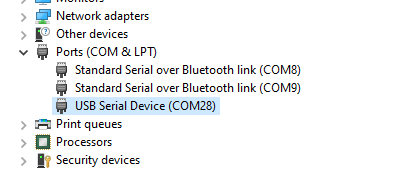
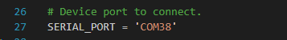

# Serial TouchDetect SDK

## Table of Contents

- [Serial TouchDetect SDK](#serial-touchdetect-sdk)
  - [Table of Contents](#table-of-contents)
  - [About](#about)
  - [Prerequisites](#prerequisites)
  - [Run the demo](#run-the-demo)

## About

This section explains how to use PowerON TouchDetect SDK to connect to sensors over UART communications. This library can also use an USB to serial converter in order to connect to the device.

## Prerequisites

Reffer to [README.md](README.md) to get a list of the requisites to use this library.

- Before starting the demo, plug TouchDetect with USB cable.

- Check which port belongs to the development board:
  - Open Device manager:

     

  - In the **Ports** TouchDetect can be found. In this case, port is **COM28**:

     

- Take note of this port and go to [serial_demo.py](demo/serial_demo.py). Change the port in this line:

    

- Unplug TouchDetect.

## Run the demo

- Make sure that you follow **Prerequisites** in order to run the library.

- Enable the pipenv of the SDK

  ```bash
    # Start the environment
    pipenv shell
  ```

- Plug BLETouchDetect. The device will turn on one red led. This means that the device is powered and ready to be used.

- Run the demo

  ```bash
    # Start the demo
    python.exe .\demo\serial_demo.py
  ```

  The script will connect to the device with the name **SERIAL_PORT**. Once the connection was stablished, it will publish in the console the ADC value of each taxel node.

- To stop the demo, press **ENTER**. The script will close the serial connection and stop publishing messages.
