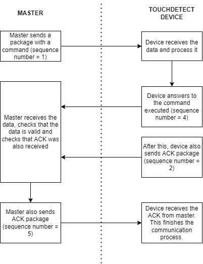

# Guidelines for writing your own SDK

## Table of Contents

- [Guidelines for writing your own SDK](#guidelines-for-writing-your-own-sdk)
  - [Table of Contents](#table-of-contents)
  - [About](#about)
  - [Description of communication protocol](#description-of-communication-protocol)
  - [Communication procedure](#communication-procedure)
  - [Sending wrong command](#sending-wrong-command)
  - [Communication Timeout](#communication-timeout)
  - [Commands supported](#commands-supported)

## About

Although PowerON is commited to bring support for more platforms, the support is right now limited. That is why this document aims to support external developers in the implementation of their own SDK.

## Description of communication protocol

The communication to the device is performed through [HDLC](https://en.wikipedia.org/wiki/High-Level_Data_Link_Control). Some key elements of this protocol:

- TouchDetect implements Asynchronous framing.
- Each data is sent through packages. TouchDetect supports 2 types of packages:
  - Data frame (called I-frame), which is used to send a to a device.
  - Supervisory frames (called S-frames). These are used for controlling to control the flow of data. Example of this are the ACK packages.
- TouchDetect uses CDC port (Virtual COM port). Values such as baudrate, parity, stopbits, etc are not being emulated. However, libraries usually require setting these parameters in order to open a serial port. These are the parameters suggested:
- Baudrate: 115200
- stopbits: 1bit
- parity: none

## Communication procedure

The image below describes the communication procedure:

1. In order to start the communication, a data package must be sent with the command to execute. The payload of the package is 1 byte which identifies the command to execute.
2. TouchDetect reads the command, process the data and replies with the information requested. Appart from sending a data package, it also sends an ACK package.
3. Master will receive both packages one after the other. The master has 50ms to reply with an ACK to the device or otherwise the communication will be considered as failed. The device will not attempt to send the data again but it will flash a red led indicating the failure.
4. Once ACK is received withing the time frame of 50ms, the device flashes the green led and resets it's state to start a new communication procedure.

## Sending wrong command

In case the master starts a communication with the wrong command, the device will reply with a NACK package and flash the red led, indicating an error.

## Communication Timeout

As mentioned before, if the master takes more than 50ms to reply with and ACK, the device will consider the communication as lost, will flash the red led and reset its state to start a new communication cycle.

## Commands supported

Here can be seen the list of commands supported. Each command must be sent as a I-frame (data package). Commands have a size of 1byte.

| Command |                         Description                       |                  reply                     |
|---------|-----------------------------------------------------------|--------------------------------------------|
|  0x00   | this command is used to check the presence of the device. | data package with no payload + ACK package |
|  0x01   | Data of sensor arrays. Data is presented in ADC values from 0 to 4095. Value is splitted in 2 bytes and most significant byte is sent first. | data package with 72 bytes as payload (36 taxels splitted in  2 bytes) + ACK package        |